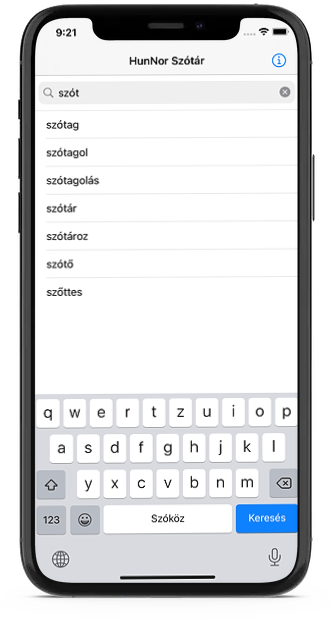

# HunNor of iOS

iOS application for the HunNor dictionary.

# How to run the app

1. Install Xcode
1. Clone the repository
1. Generate the Realm database from the XML dump files using [`export-ant`](https://github.com/hunnor-dict/export-ant) and [`export-realm`](https://github.com/hunnor-dict/export-realm)
1. Copy the Realm database to `HunNor/Database/HunNor.realm`
1. Build and run the application

Mockups by [Smartmockups](https://smartmockups.com/)

